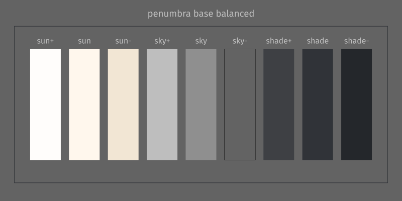
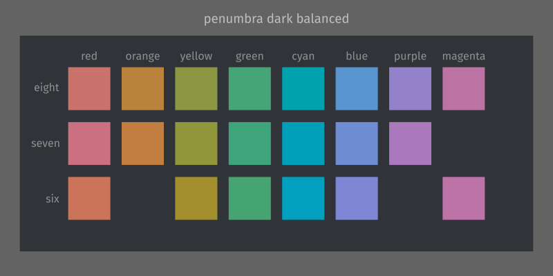
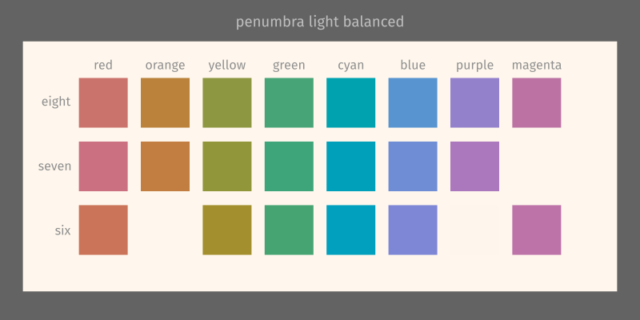
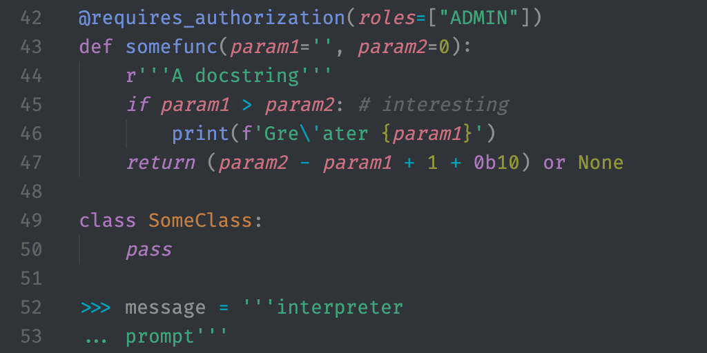

# VSCode Theme Using the Penumbra Color Scheme

Penumbra is a mathematically balanced colour scheme constructed in a perceptually uniform colour space with base colours inspired by the shades of colour occuring in nature due to the light of the sun and the sky. To my knowledge, it's the first to cleanly separate the perceptual properties of colours while optimally utilising the available colour space of typical displays.

The nine base colours are (almost fully, see below) symmetric and used to build the main light and dark theme, drawing from differently sized accent colour palettes as necessary. Additionally, there are two variants of the dark theme with enhanced contrast, ideal for anyone with mild to moderate visual impairments. Due to the constraints of the design principles, none are particularly suitable for people with colour vision deficiency.

The accent colour palettes also lend themselves to encoding quantitative information in data visualisations.

## Features

The goal of this colour scheme is to cleanly separate the use of each of the three perceptual properties of colour — luminance, chroma and hue — and optimally utilise the typically available colour space to encode information with each of them. Function is put before aesthetics, but the base colours inspired by nature and low but sufficient contrast attempt to make the overall scheme pleasing to the eye. 

### 1. Base Colours Inspired By Nature
The base colours are derived from the CIE D series of standard illuminants that are modeled after natural daylight (and also used to calibrate the white point of almost all consumer displays), ranging from the evening sun through neutrally white summer daylight to shade and overcast skies. Dark colours appearing like shade and light colours like paper illuminated by sunlight creates an overall pleasing aesthetic that still fades into the background as that’s what you are used to when going outside.

### 2. Just Enough Contrast
Designed to exactly meet the minimum contrast level for legibility on electronic visual displays specified in ISO-9241-3. While legibility is important to reduce eye strain, for many people, too much contrast is also subjectively contributing to it. Enhanced contrast versions -- for anyone with mild or moderate visual impairments respectively -- exceed the minimum contrast recommended by the W3C.

### 3. Optimal Hue Differentiability
By using the perceptually uniform colour space [Oklab](https://bottosson.github.io/posts/oklab), I was able to achieve perceptually uniform hue differences between each of the accent colours, ensuring maximum differentiability between highlighted words. Constant chroma ensures none of them stand out from or recede into the page more than others.

 ### 4. Fluidly Readable Code
Because the text and accent colours have identical luminance, it’s easier to read code like a continous text and follow logical syntax while maintaining the ability to scan it for highlighted words with higher chroma.

### 5. Easily Nameable Colours
Within the constraints described above, the colour hues are optimised to produce colours as close as possible to intuitively named colours as found in the [xkcd Color Survey](https://blog.xkcd.com/2010/05/03/color-survey-results/). This makes communicating about the colours just that tiny bit easier and quicker.

## images

### Dark

### Light

### Dark Contrast+

### Dark Contrast++

## Also Available For

### Editors and IDEs

Coming Soon

### Terminal Emulators

* **iTerm2**

## Contributions

See the main [Penumbra repository](https://github.com/altercation/solarized).

## Acknowledgments

The search for a theme led me to [Solarized](https://github.com/altercation/solarized) by Ethan Schoonover, which I was ultimately not satisfied with but inspired me to try and improve on its ideas.

[Oklab](https://bottosson.github.io/posts/oklab/) by Björn Ottosson gave me the tools to be able to painlessly design the colours.

The [xkcd Color Survey](https://blog.xkcd.com/2010/05/03/color-survey-results/) provided a quantitative basis for colour names.

[Pluto Notebooks](https://github.com/fonsp/Pluto.jl) with [Colors.jl](https://github.com/JuliaGraphics/Colors.jl) for the Julia language made it effortless to work with colour in a systematic but visual way.